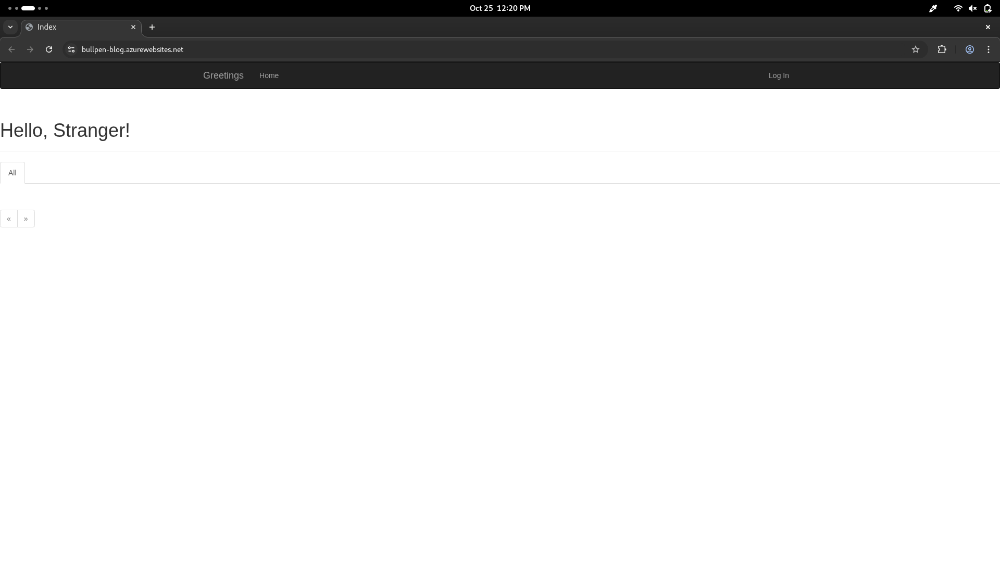
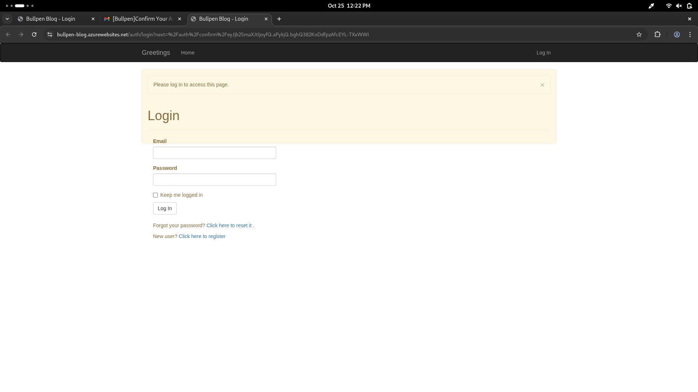
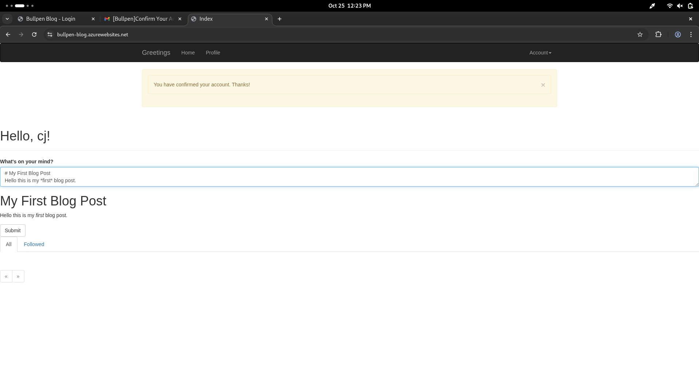
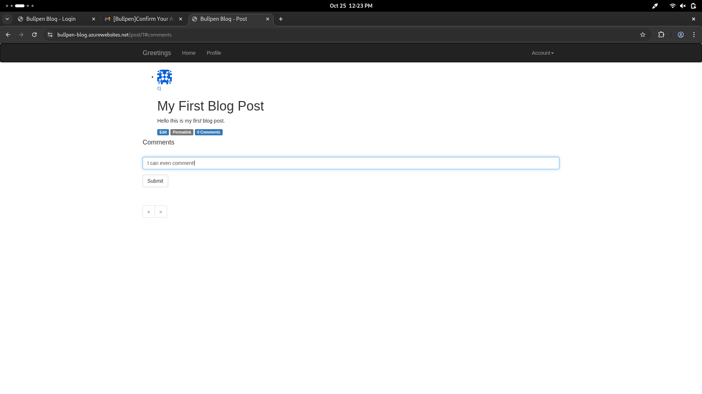
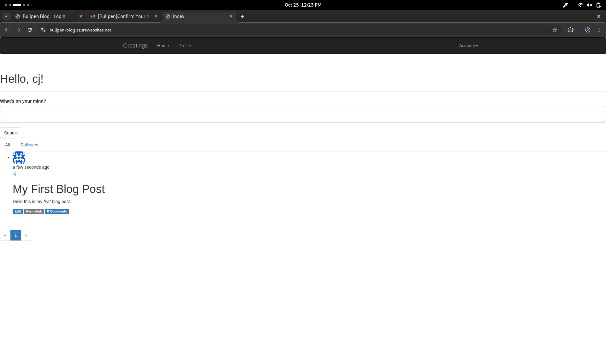
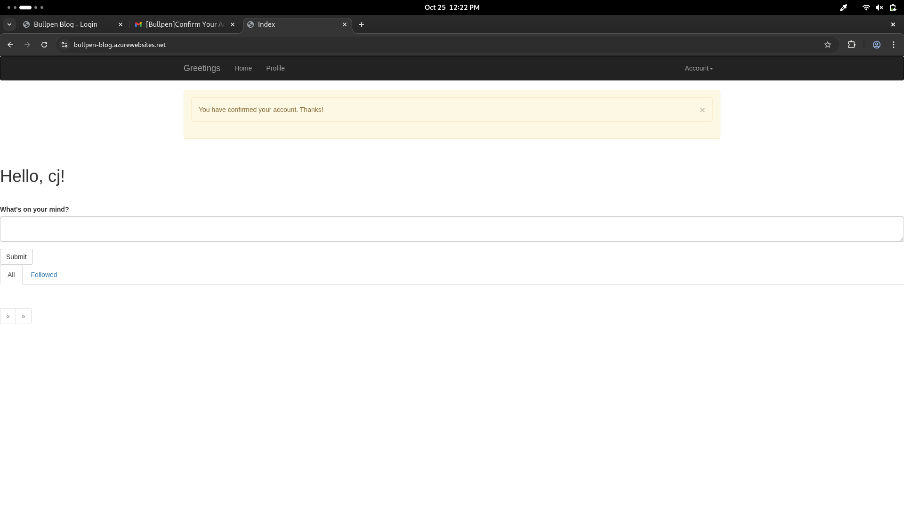

# Bullpen Blog — Modular Flask Blog with API & Jinja Frontend

> A production-ready, modular Flask blog application with a Jinja-rendered web UI and a companion REST API, fully containerized and deployable to Azure.

Bullpen Blog demonstrates **full-stack Python web development** combined with modern **DevOps and cloud deployment practices**. It is designed as both a teaching resource and a real-world app, showcasing:

- Modular Flask architecture (`app/main`, `app/api`, `app/auth`)  
- RESTful API endpoints for posts, users, and comments  
- Secure user authentication and role-based authorization  
- Database modeling with SQLAlchemy and Alembic migrations  
- Email notifications with Flask-Mail and form validation  
- Containerized deployment using **Docker** and Azure App Service  
- Automated infrastructure provisioning with **Bicep**  
- Centralized logging for both local and cloud environments  

---

## Key Features

### Web Frontend
- **Responsive, Jinja2-based UI** using Bootstrap 3/4 classes and macros.
- Modular templates and route structure under `app/main`.
- Pagination for posts and timelines.
- Error pages and email-confirmation flows with user-friendly feedback.

### REST API
- Fully-featured API blueprint under `app/api` serving JSON for posts, users, and comments.
- Authentication via **HTTP Basic Auth** or tokens with `Flask-HTTPAuth`.
- Role-based permission checks with a `permission_required` decorator.
- Input sanitization: Markdown -> safe HTML via **Bleach + Markdown**.

### User & Account Management
- Registration, login, email confirmation, password reset, and profile editing.
- Role and permission management for secure access control.
- Email notifications for user actions using **Flask-Mail**.

### Backend & Database
- SQLAlchemy models for users, posts, comments, and roles.
- Alembic migrations for safe schema evolution.
- Unit and integration tests in `tests/` to validate models and API behavior.

### Deployment & DevOps
- Containerized with **Docker**, ready for production with Gunicorn.
- Azure Web App container deployment with persistent `/home/LogFiles/Application` logging.
- Automated startup scripts (`boot.sh`) and update scripts for reliable deployments.
- Infrastructure-as-Code via **Bicep** for App Service, PostgreSQL database, Key Vault, and firewall rules.
- Logs automatically captured locally and downloadable from Azure CLI.

### Logging & Monitoring
- Local development logs (`app/logs`) for debugging.
- Cloud-ready logs under `/home/LogFiles/Application` for Azure Web App integration.
- Combined stdout/stderr and persistent logs for full traceability.

---

## Why This Project Matters

Bullpen Blog is more than a simple Flask app. It’s a **demonstration of real-world software engineering skills**, including:

- Pythonic architecture and clean code
- RESTful API design and secure authentication
- Database modeling, migrations, and testing
- Cloud deployment, logging, and DevOps automation
- Containerization and infrastructure-as-code best practices

